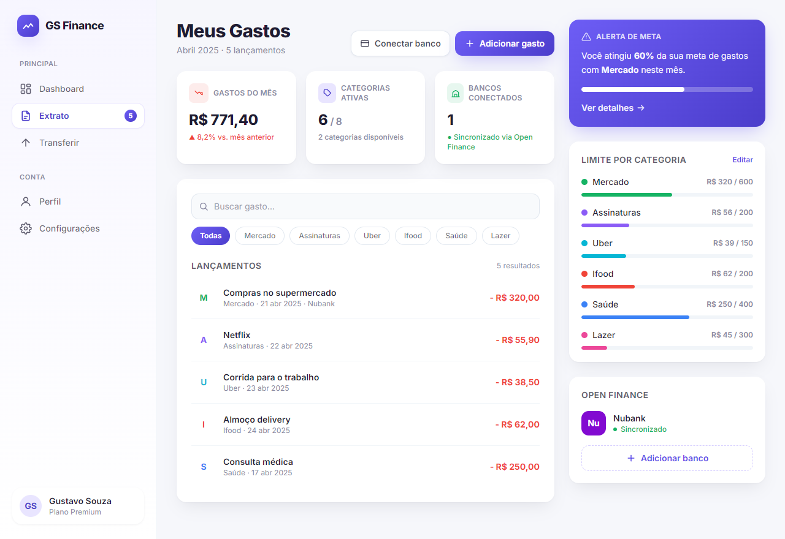

# GS Finance — Dashboard de Gastos 💸

Tela de **Dashboard / Extrato de gastos** de uma fintech de finanças pessoais,
construída para a atividade da FIAP (Fase de HTML, CSS e Tailwind CSS).

Recriação fiel da tela desenhada no Figma na Fase 2, com um acabamento visual mais polido,
mantendo a mesma identidade (roxo/violeta, cards arredondados, sombras suaves).



## ✨ Funcionalidades da tela

- **Resumo do mês** — total gasto, categorias ativas e bancos conectados.
- **Lançamentos** — lista de gastos com categoria, data e banco de origem.
- **Limite por categoria** — barras de progresso de orçamento por categoria.
- **Alerta de meta** — destaque de quanto da meta mensal já foi atingida.
- **Open Finance** — banco sincronizado (Nubank) e opção de adicionar mais.
- **100% responsivo** — sidebar no desktop, *bottom navigation* no mobile.

## 🛠️ Tecnologias

- **HTML5** semântico — `index.html`
- **Tailwind CSS** — utilitários no markup + tema customizado (`tailwind.config.js`)
- **CSS** separado em `styles.css` (saída compilada do Tailwind)
- Ícones em **SVG inline** (sem dependência de imagens externas → abre offline)

## ▶️ Como abrir

O projeto já vem com o CSS compilado. Basta abrir o arquivo:

```
index.html
```

Não precisa de internet, build, nem servidor — clicar duas vezes no `index.html` funciona.

## 🔧 Recompilar o Tailwind (opcional)

Caso queira alterar o layout e gerar o `styles.css` novamente:

```bash
npm install
npm run build      # gera styles.css minificado
npm run dev        # modo watch durante o desenvolvimento
```

## 📁 Estrutura

```
.
├── index.html            # estrutura da tela (HTML)
├── styles.css            # estilos compilados do Tailwind (CSS)
├── src/input.css         # entrada do Tailwind (@tailwind base/components/utilities)
├── tailwind.config.js    # tema: cores da marca, sombras, gradientes
└── package.json          # scripts de build
```

---

Projeto desenvolvido por **Gustavo** · FIAP · Front-end Design Engineering.
